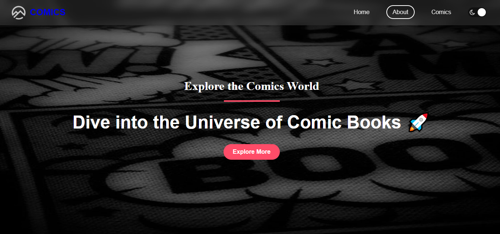
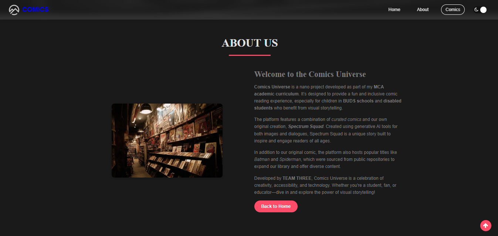
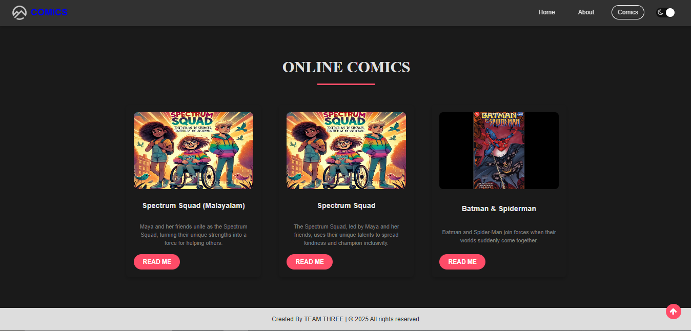
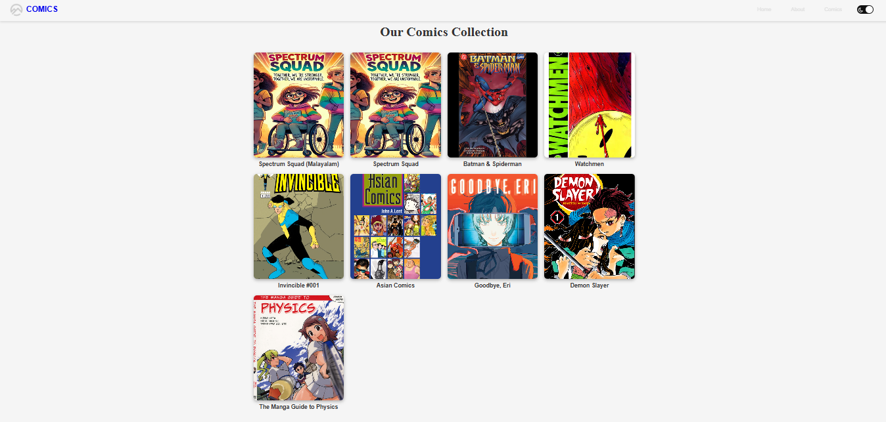
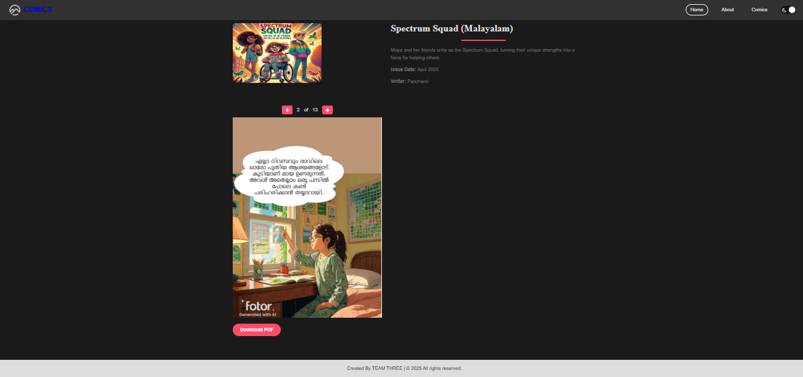

###Comics Universe
Comics Universe is a web-based comic reading platform developed as part of an MCA academic curriculum. Designed to provide a fun and inclusive experience, it targets children in BUDS schools and disabled students who benefit from visual storytelling. The platform features a mix of curated comics (e.g., Batman & Spiderman, Watchmen) and an original AI-generated comic, Spectrum Squad, created with generative AI tools for images and dialogues. Built with HTML, CSS, and JavaScript, it offers a Netflix-like gallery, PDF viewer, dark mode, and responsive design with zoom-in animations for an engaging user experience.
Features

Homepage: Showcases three featured comics (Spectrum Squad Malayalam, Spectrum Squad English, Batman & Spiderman) with zoom-in animation on the "Explore More" button.
About Section: Details the project's purpose and features, with a hover zoom-in effect on the comic-themed image.
Comics Section: Displays three comics with hover zoom-in animations on each card for a dynamic effect.
Comics Gallery: A Netflix-like grid of all nine comics, with hover effects to highlight "Read Now" overlays.
Comic Details: Displays comic details (title, description, writer, issue date) and an interactive PDF viewer with page navigation and download option.
Responsive Design: Mobile-friendly layout with collapsible navbar and adaptive grids (tested at 850px, 600px, 470px).
Dark Mode: Toggle for eye comfort, with smooth transitions.
Multilingual Support: Includes Spectrum Squad in English and Malayalam.
AI-Generated Content: Spectrum Squad uses AI for images and dialogues, showcasing innovative storytelling.
Animations: Subtle zoom-in effects on hover for the "Explore More" button, About image, and comic cards.

## Screenshots
The following screenshots showcase key features of Comics Universe. All images are located in the `screenshots/` directory.

1. **Homepage**
   
   Displays the header with the "Explore More" button (hover to see zoom-in effect), navbar with logo and dark mode toggle, and the featured comics section.

2. **About Page**
   
   Shows the About section with a comic-themed image (hover for zoom-in animation) and a detailed description of the project's purpose and features.

3. **Comics Page**
   
   Highlights the three featured comics (Spectrum Squad Malayalam, Spectrum Squad English, Batman & Spiderman) with hover zoom-in effects on each card.

4. **Comics Gallery**
   
   Presents the Netflix-like gallery in `comics-gallery.html`, displaying all nine comics with "Read Now" hover overlays.

5. **Comic Details**
   
   Shows the comic details page with a cover image, details (title, writer, etc.), and PDF viewer (e.g., for *Watchmen*, ID 4).

Setup Instructions

Clone or Download:

Download the project to C:\Users\HP\Desktop\COMIC_CREATIONS or clone the repository (if hosted).

Verify Assets:

Ensure all images are in assets/img/ and PDFs are in assets/pdfs/ (see Project Structure).
If missing, create placeholders:
Images: 300x400px PNGs with comic titles (e.g., "Watchmen" for watchemen.png).
PDFs: Single-page PDFs with comic titles.

Run a Local Server:

Open a terminal in C:\Users\HP\Desktop\COMIC_CREATIONS:cd C:\Users\HP\Desktop\COMIC_CREATIONS
python -m http.server 8000

Alternatively, use VS Code with the Live Server extension (port 5500).
Open http://localhost:8000/index.html in a browser (Chrome, Firefox recommended).

Test the Application:

Homepage: Verify the navbar, header ("Explore More" zoom-in), About section (image zoom-in), and Comics section (card zoom-in).
Gallery: Check comics-gallery.html for all nine comics with hover effects.
Comic Details: Test comic-details.html?id=1 to id=9, ensuring cover images and PDFs load (especially IDs 4–9).
Responsiveness: Resize browser to 850px, 600px, 470px to confirm mobile-friendly layout.
Console: Open F12 → Console to check for net::ERR_FILE_NOT_FOUND errors.

Dependencies

FontAwesome 4.7.0: For icons (navbar, dark mode toggle, PDF navigation, scroll-to-top).
Loaded via CDN: https://cdnjs.cloudflare.com/ajax/libs/font-awesome/4.7.0/css/font-awesome.min.css

jQuery 3.6.0: For menu toggle, dark mode, and scroll functionality.
Loaded via CDN: https://code.jquery.com/jquery-3.6.0.min.js

PDF.js 3.11.174: For rendering PDFs in the comic details page.
Loaded via CDN: https://cdnjs.cloudflare.com/ajax/libs/pdf.js/3.11.174/pdf.min.js
Worker: https://cdnjs.cloudflare.com/ajax/libs/pdf.js/3.11.174/pdf.worker.min.js

Google Fonts: Lora, Montserrat, Roboto for typography.
Included in HTML <head> (no external setup needed).

No local installations are required, as all dependencies are loaded via CDNs

Contributing
This is an academic project submitted as part of an MCA curriculum. Contributions are not accepted, but feedback from instructors or peers is welcome for evaluation purposes.
License
This project is for academic purposes only and not licensed for commercial use. All curated comics (e.g., Batman & Spiderman, Watchmen) are sourced from public repositories, and Spectrum Squad is an original creation by Team Three.
Credits

Developed by: Team Three (MCA students)
Resources:
Spectrum Squad: Created using generative AI tools for images and dialogues.
Curated comics: Sourced from public repositories.
FontAwesome, jQuery, PDF.js: Open-source libraries via CDN.
Google Fonts: Lora, Montserrat, Roboto for typography.

Created with ❤️ for visual storytelling and accessibility.
